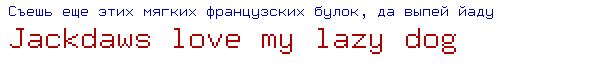

## cyrfont

9x15 scalable **golang.org/x/image/font/basicfont/Face**.

Includes basic latin and cyrillic.

Font come from the XFree86 distribution, and was created by Markus Kuhn.

Example:



```go
package main

import (
	"image"
	"image/color"
	"image/png"
	"os"

	"golang.org/x/image/font"
	"golang.org/x/image/math/fixed"

	"github.com/enotofil/cyrfont"
)

func main() {
	img := image.NewRGBA(image.Rect(0, 0, 600, 80))

	d := &font.Drawer{
		Dst:  img,
		Src:  image.NewUniform(color.RGBA{0x00, 0x00, 0xaa, 0xff}),
		Face: cyrfont.Face9x15,
		Dot:  fixed.Point26_6{fixed.Int26_6(8 * 64), fixed.Int26_6(16 * 64)},
	}
	d.DrawString("Съешь еще этих мягких французских булок, да выпей йаду")
	d = &font.Drawer{
		Dst:  img,
		Src:  image.NewUniform(color.RGBA{0xaa, 0x00, 0x00, 0xff}),
		Face: cyrfont.Scaled9x15(2),
		Dot:  fixed.Point26_6{fixed.Int26_6(8 * 64), fixed.Int26_6(48 * 64)},
	}
	d.DrawString("Jackdaws love my lazy dog")

	f, err := os.Create("cyrfont.png")
	if err != nil {
		panic(err)
	}
	defer f.Close()
	if err := png.Encode(f, img); err != nil {
		panic(err)
	}
}
```
